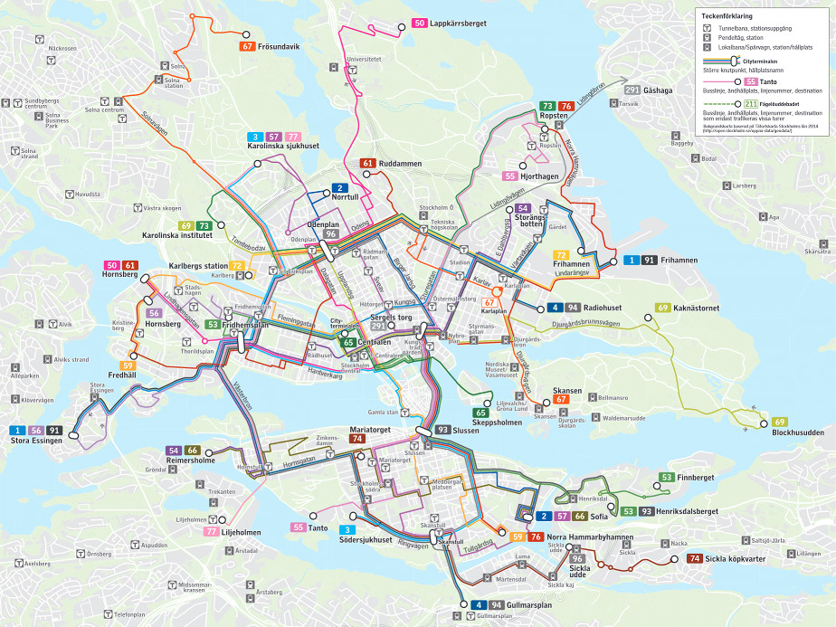
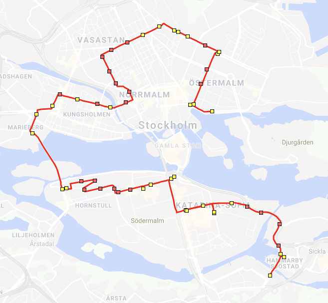

# Omnibus

Riding all bus lines in Stockholm in the minimum possible time.

 

The challenge was to ride at least one stop on all regularly scheduled city bus lines in Stockholm
in the minimum possible time. As of October 2018, Stockholm has 28 city bus lines:

<pre>
1, 2, 3, 4, 6         blue commuting buses
50 - 77 (16 lines)    regular city buses
58                    cemetery bus, 3 services / year
68                    event bus, irregular service
75                    rush hour bus
91, 93, 94, 96        night buses
</pre>

This project is limited to the 21 regularly scheduled bus lines
(1, 2, 3, 4, 6, 50, 53, 54, 55, 56, 57, 61, 65, 66, 67, 69, 71, 72, 74, 76, 77).

The program uses the [GTFS data from Trafiklab](https://www.trafiklab.se/api/gtfs-regional-beta),
and employs a best-first search with pruning to find the fastest route. A walking distance of
100 meters is allowed between stops when changing buses. What makes the algorithm slightly
different than using a regular priority queue / Dijkstra is the added condition of using all
bus lines. A route is thus pruned if it visits a stop that has already been visited at a faster
time and with the same or more bus lines used.

For a fixed start point, the solution is found in a couple of minutes on my laptop, and for any
start point it takes around 38 minutes, and is as follows:

 

<pre>
2311.91 s; 42054017 states visited; 45248645 (51.83 %) states pruned; 3588365 states queued
21 routes: 61, 67, 57, 77, 76, 74, 72, 4, 3, 2, 1, 56, 55, 53, 71, 69, 66, 65, 6, 54, 50
12:19:18  12:21:36  Bus 69  1 stop   Styrmansgatan - Nybroplan
12:21:36  12:23:18  Walk    72 m     Nybroplan - Nybroplan
12:28:23  12:34:47  Bus 54  3 stops  Nybroplan - Östermalmstorg - Karlavägen - Jungfrugatan
12:34:47  12:36:11  Walk    54 m     Jungfrugatan - Jungfrugatan
12:41:11  12:43:48  Bus 72  2 stops  Jungfrugatan - Musikhögskolan - Stadion
12:47:53  12:48:00  Bus 6   1 stop   Stadion - Östra station
12:48:00  12:49:55  Walk    85 m     Östra station - Östra station
12:55:00  12:57:41  Bus 67  1 stop   Östra station - Odengatan
13:01:52  13:03:38  Bus 61  1 stop   Odengatan - Roslagsgatan
13:08:53  13:22:44  Bus 50  8 stops  Roslagsgatan - Stadsbiblioteket - Odenplan - Vasaparken - Sabbatsbergs sjukhus - Tegnérgatan - Norra Bantorget - Cityterminalen - Kungsbroplan
13:28:22  13:31:05  Bus 65  2 stops  Kungsbroplan - Scheelegatan - S:t Eriks ögonsjukhus
13:41:10  13:44:00  Bus 1   2 stops  S:t Eriks ögonsjukhus - S:t Eriksgatan - Fridhemsplan
13:48:00  13:49:35  Bus 56  1 stop   Fridhemsplan - Mariebergsgatan
13:56:17  13:58:38  Bus 4   1 stop   Mariebergsgatan - Västerbroplan
14:05:55  14:08:04  Bus 77  1 stop   Västerbroplan - Högalidsgatan
14:08:04  14:09:56  Walk    82 m     Högalidsgatan - Långholmsgatan
14:17:04  14:27:52  Bus 66  8 stops  Långholmsgatan - Varvsgatan - Skinnarviken - Högalidskyrkan - Ansgariegatan - Ringvägen - Zinkensdamm - Hornsgatan/Rosenlundsgatan - Krukmakargatan
14:27:52  14:28:26  Walk    4 m      Krukmakargatan - Krukmakargatan
14:35:09  14:36:30  Bus 55  1 stop   Krukmakargatan - Mariatorget
14:41:40  14:44:00  Bus 57  1 stop   Mariatorget - Slussen
14:44:00  14:45:38  Walk    68 m     Slussen - Slussen
14:50:00  14:58:42  Bus 3   3 stops  Slussen - Medborgarplatsen - Nytorgsgatan - Åsögatan
14:58:42  14:59:34  Walk    22 m     Åsögatan - Åsögatan
15:03:51  15:07:12  Bus 76  2 stops  Åsögatan - Nytorgsgatan - Medborgarplatsen
15:07:12  15:07:56  Walk    14 m     Medborgarplatsen - Medborgarplatsen
15:13:10  15:15:10  Bus 2   1 stop   Medborgarplatsen - Nytorgsgatan
15:20:05  15:22:31  Bus 53  1 stop   Nytorgsgatan - Ersta sjukhus
15:29:09  15:35:00  Bus 71  5 stops  Ersta sjukhus - Londonviadukten - Danvikstull - Henriksdal - Kanalvägen - Sickla udde
15:35:00  15:36:56  Walk    86 m     Sickla udde - Sickla udde
15:41:00  15:43:02  Bus 74  1 stop   Sickla udde - Sickla kaj
</pre>

During field testing, it became apparent that it's not realistic to expect all 20 connections to
arrive reasonably in time (even though the route allows buses to be up to 4 minutes late), and
even a single missed connection would likely invalidate the rest of the route. A planned future
version is thus to use real time traffic information plus my current location to continuously
re-calculate the best route to ride the remaining bus lines.
